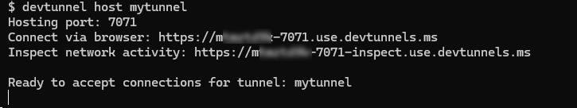

# Entra ID Setup instructionsAdd authentication to the API plugin

NOTE: There are many detailed setup steps for Entra ID in this lab. A preview version of Teams Toolkit is available which will automate many of these steps for you; we hope to provide a more streamlined version of the lab when it's released. However this could still be useful for those wishing to understand exactly what needs to be provisioned to get OAuth working.

You will register Entra ID applications that are used to secure your plugin and API. Before you begin, choose a safe place for your app information. You will be saving:

| Configuration field | Value |
| --- | --- |
| API Base URL | |
| API service Application (client) ID | |
| API service Directory (tenant) ID | |
| Authorization endpoint | |
| Token endpoint | |
| API service client secret | |
| API scope | |
| Plugin service application (client) ID | |
| Plugin service client secret | |

## Part 1: Set up a persistent developer tunnel 

By default, Teams Toolkit creates a new developer tunnel - and thus a new URL for accesing your locally running API - every time you start the project. Normally this is fine because Teams Toolkit automatically updates the URL where needed, but since this lab will be a manual setup, you'll have to manually update the URL in Entra ID and in Teams Developer Portal each time you start the debugger. For that reason, you may wish to set up a persistent developer tunnel with a URL that does not change.

### Step 1: Install the developer tunnel CLI

Here are the command lines for installing the developer tunnel. [Full instructions and download links for the Developer Tunnel are here.](https://learn.microsoft.com/azure/developer/dev-tunnels/get-started){target=_blank}. 

| OS | Command |
| --- | --- |
| Windows | `winget install Microsoft.devtunnel` |
| Mac OS | `brew install --cask devtunnel` |
| Linux | `curl -sL https://aka.ms/DevTunnelCliInstall | bash` |

!!! tip
    You may have to restart your command line to update the file path before devtunnel commands will work

Once you have it installed, you'll need to log in. You can use your Microsoft 365 account to log in.

~~~sh
devtunnel user login
~~~

<cc-lab-step lab="e6" exercise="1" step="2" />
### Step 2: Create and host the tunnel

Then you'll need to set up a persistent tunnel to the Azure Functions local port (7071).
You can use these commands and substitute your own name instead of "mytunnel" if you wish.

~~~sh
devtunnel create mytunnel -a --host-header unchanged
devtunnel port create mytunnel -p 7071
devtunnel host mytunnel
~~~

The command line will display the connection information, such as:

Copy the "Connect via browser" URL and save it as the "API Base URL".

## Exercise 2: Register an Entra ID application for your API

### Step 1: Add a new Entra ID app registration

Browse to the Entra ID admin center either via the [Microsoft 365 Admin center](https://portal.office.com/AdminPortal/){target=_blank} or directly at [https://entra.microsoft.com/](https://entra.microsoft.com/){target=_blank}. Make sure you are logged into your development tenant and not some other.

Once you're there, click "Identity" 1️⃣, then "Applications" 2️⃣, and then "App registrations" 3️⃣. Then click the "+" 4️⃣ to add a new app registration.

Give your application a unique and descriptive name such as "My API Service" 1️⃣. Under "Supported account types", select "Accounts in this organizational directory only (Microsoft only - single tenant) 2️⃣. Under "Redirect URI (optional)" select "Web" and enter the URL of your developer tunnel 3️⃣. 

Then click "Register" 4️⃣ to register your application.

> Note "Only single tenant apps work at the moment"
    Software vendors and others will want their app to work across multiple Microsoft 365 tenants, however at the time of this writing that doesn't work, so for now stick with the "Accounts in this organizational directory" option.

### Step 2: Copy application info to a safe place
Copy the Application ID (also called the Client ID) 1️⃣ and the tenant ID (also called the directory ID) 2️⃣ to a safe place; you'll need them later. Then click on the Endpoints button 3️⃣ to open the Endpoints flyout.

Now copy the first two endpoint URL's, the "OAuth 2.0 authorization endpoint (v2)" 1️⃣ and "OAuth 2.0 token endpoint (v2)" 2️⃣ and save them in the same safe place.

### Step 3: Create client secret

Next, navigate to "Certificates & secrets" 1️⃣ and click "+ New client secret" 2️⃣. Give your secret a name and choose a duration. The secret will be displayed; this is your one and only chance to view it as secrets are only displayed in the portal when they're first created. Copy the secret 3️⃣ to your safe storage place.

### Step 4: Expose an API Scope

In order to validate calls to your API, you need to expose an API Scope, which represents the permission to call the API. Though these could be very specific - allowing permission to do specific operations via the API - in this case we'll set up a simple scope called "access_as_user".

First, browse to "Expose an API" 1️⃣ and, next to "Application ID URI" click "Add" 2️⃣. A flyout will open on the right; you can stay with the default value which is api://&lt;your application (client) ID&gt;. Go ahead and click "Save and continue" 3️⃣ to proceed.

Under "Add a scope" enter "access_as_user" as the scope name 1️⃣. Fill in the remaining fields as follows:

| Field | Value |
| --- | --- |
| Who can consent? | Admins and users |
| Admin consent display name | Access My API as the user |
| Admin consent description | Allows an API to access My API as a user |
| User consent display name | Access My API as you |
| User consent description | Allows an app to access My API as you |
| State | Enabled |

When you're done, click "Add Scope" 2️⃣.

### Step 5: Save the API Scope
Copy the scope to your safe place as the "API Scope".

## Part 3: Register an Entra ID application for your plugin

Now that you've registered an API for the application, it's time to register the plugin itself.

### Step 1: Register the plugin

Return to the "App registrations" section and register a second application. This time call it "My API Plugin" 1️⃣, and once again set "Supported account types" to "Accounts in this organizational directory only" 2️⃣.

> Note "Only single tenant apps work at the moment"
    Software vendors and others will want their app to work across multiple Microsoft 365 tenants, however at the time of this writing that doesn't work, so for now stick with the "Accounts in this organizational directory" option.

Under "Redirect URL" select "Web", and this time set it to `https://teams.microsoft.com/api/platform/v1.0/oAuthRedirect` 3️⃣. This is the Teams location that will handle completed logins to the API Plugin application.

Click the "Register" button 4️⃣ to complete the registration.

As before, view the app's "Overview" page and save the Application (client) ID for the API Plugin app.

### Step 2: Create a client secret

As before, create a client secret and save it under "Plugin service client secret" in your safe location.

### Step 3: Grant permission

Your plugin needs to call your API service, so naturally it needs permission to do that. Begin by navigating to "API permissions". Then click the "APIs my organization uses" tab 1️⃣ and search for your API service 2️⃣. Select your API service from the results 3️⃣.

Now you should see your API service application. Select the "access_as_user" permission and click "Add permission".

## Part 4: Update the API app registration with the plugin application ID

### Step 1: Add the Plugin app's ID to the API service app

Now the API Service application needs to allow the API Plugin application to issue tokens for it. To enable this, return to the App Registration for your API Service application. Select "Manifest" and find the entry for `knownClientApplications` 1️⃣. Add your My Plugin App's client ID to this entry as follows:

~~~json
"knownClientApplications": [
    "<your-plugin-client-id>"
]
~~~

Remember to click "Save" 2️⃣ when you're done.

## Part 5: Register the OAuth information in the Teams Developer Portal

Now you're apps are all set up, but Microsoft 365 doesn't know anything about it. It wouldn't be safe to store secrets in the app manifest, so Teams has set up a place in the Teams Developer Portal to safely store this information. In this exercise you'll se the Teams Developer Portal to register your OAuth client application so Copilot can authenticate users for it.

### Step 1: Create a new OAuth client registration

Browse to the Teams Developer Portal at [https://dev.teams.microsoft.com](https://dev.teams.microsoft.com){target=_blank}. Select "Tools" 1️⃣ and then "OAuth client registration" 2️⃣.

Click "+ New OAuth client registration" and fill in the form. Several of the fields are from your safely stored information you've been building up over the last few exercises.

| Field | Value |
| --- | --- |
| Name | Choose a name you'll remember |
| Base URL | your API service Base URL |
| Restrict usage by org | select "My organization only" |
| Restrict usage by app | select "Any Teams app" |
| Client ID | Your **Plugin Application** (client) ID |
| Client secret | Your **Plugin Application ** client secret |
| Authorization endpoint | Your authorization endpoint (same for both API Service and API Plugin apps) |
| Token endpoint | Your token endpoint (same for both API Service and API Plugin apps) |
| Refresh endpoint |  Your token endpoint (same for both API Service and API Plugin apps) |
| API scope | Your API Service application's scope |

### Step 2: Save your OAuth registration ID

The portal will display your OAuth client registration ID. Save this for the next step.

Equipped with all the values you've saved, return to the [main instructions](./README.md#setup-instructions-one-time-setup) to proceed.