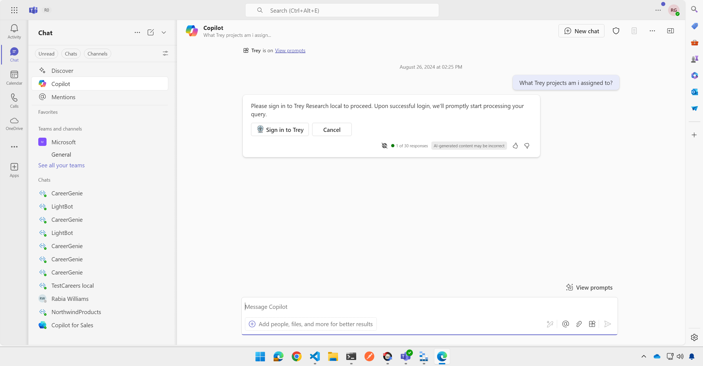

# Trey Research Copilot extension (OAuth version)

Trey Research is a fictitious consulting company that supplies talent in the software and pharmaceuticals industries. The vision for this demo is to show the full potential of Copilot extensions in a relatable business environment.

> NOTE: The services needed to use this sample are in private preview only

> NOTE: This version of the Trey Research sample uses OAuth authentication and has been tested using Entra ID as the identity service. See the Setup section below for details on configuring the necessary apps in Entra ID.

### Prompts that work

  * what trey projects am i assigned to?
    (NOTE: The first time a user accesses the service, it will create a Consultant record for that user ID. Naturally this consultant won't have any project assignments.)
  * please add me to the contoso project in trey
  * what trey projects is domi working on?
  * do we have any trey consultants with azure certifications?
  * what trey projects are we doing for relecloud?
  * which trey consultants are working with woodgrove bank?
  * in trey research, how many hours has avery delivered this month?
  * please find a trey consultant with python skills who is available immediately
  * are any trey research consultants available who are AWS certified? (multi-parameter!)
  * does trey research have any architects with javascript skills? (multi-parameter!)
  * what trey research designers are working at woodgrove bank? (multi-parameter!)
   * please charge 10 hours to woodgrove bank in trey research (POST request)
   * please add sanjay to the contoso project for trey research (POST request with easy to forget entities, hoping to prompt the user; for now they are defaulted)

Notice that each prompt mentions "trey"; this isn't necessary once you have mentioned Trey in a conversation, but it does help Copilot decide to call your plugin. This is an advantage of Declarative Copilots, where the plugin is explicitly declared and it's not necessary to establish intent to call it.

If the sample files are installed and accessible to the logged-in user,

   * find my hours spreadsheet and get the hours for woodgrove, then bill the client
   * make a list of my projects, then write a summary of each based on the statement of work.

## Plugin Features

The sample showcases the following plugin features:

  1. Declarative Copilot with branding and instructions, access to relevant SharePoint documents and the API plugin
  1. API based plugin works with any platform that supports REST requests
  1. Copilot will construct queries for specific data using GET requests
  1. Copilot updates and adds data using POST requests
  1. Multi-parameter queries to filter results
  1. Show a confirmation card before POSTing data; capture missing parameters
  1. Display rich adaptive cards
  1. Authenticate the user using Entra ID and OAuth 2.0

## Note on validating OAuth tokens

Microsoft does not provide a supported library for validating Entra ID tokens in NodeJS, but instead provides this detailed documentation{target=_blank} on how to write your own. Another useful article{target=_blank} is also available from Microsoft MVP Andrew Connell{target=_blank}. This lab uses a community provided library{target=_blank} written by Waldek Mastykarz{target=_blank}, which is intended to follow this guidance. Note that this library is not supported by Microsoft and is under an MIT License, so use it at your own risk.

## Setup

### Prerequisites

* Administrator permission in a Microsoft 365 tenant with Copilot for Microsoft 365
* [Visual Studio Code](https://code.visualstudio.com/Download)
* [NodeJS 18.x](https://nodejs.org/en/download)
* [Teams Toolkit extension for VS Code](https://marketplace.visualstudio.com/items?itemName=TeamsDevApp.ms-teams-vscode-extension)
  NOTE: If you want to build new projects of this nature, you'll need Teams Toolkit v5.6.1-alpha.039039fab.0 or newer
* [Teams Toolkit CLI](https://learn.microsoft.com/microsoftteams/platform/toolkit/teams-toolkit-cli?pivots=version-three)
  (`npm install -g @microsoft/teamsapp-cli`)
* (optional) [Postman](https://www.postman.com/downloads/)

## Setup instructions

### Register your Entra ID applications

You will need to set up 2 applications in Entra ID:

1. API Service app - is used to secure HTTP requests going to your API
2. API Plugin app - is used to represent the plugin running in Microsoft 365 that will access your API

[Detailed setup instructions are here](./README-Auth.md).
After following those steps you will have saved a number of values for the app ID's and other details needed below.

### Setup instructions (one-time setup)

1. Log into Teams Toolkit using your target tenant.

1. Add these lines to your **env/.env.local** file. Create a new file if there isn't already one present, and fill in the values you stored during app registration.

~~~text
API_APPLICATION_ID=<your-api-service-client-id>
API_TENANT_ID=<your-tenant-id>
~~~

1. If your project doesn't yet have a file **env/.env.local.user**, then create one by copying **env/.env.local.user.sample**. If you do have such a file, ensure it includes these lines.

~~~text
SECRET_STORAGE_ACCOUNT_CONNECTION_STRING=UseDevelopmentStorage=true
~~~

1. Update the Plugin file: Open the **appPackage/trey-plugin.json** file and find the line:

~~~json
"reference_id":  "<your oauth plugin vault reference id>"
~~~

Fill in your OAuth plugin vault reference ID from when you registered the app in Teams Developer portal.

1. Update the Open API Definition file

Since you will be using a persistent developer tunnel for your API, find this line in the **appPackage/trey-definition.json** and put your tunnel URL in place of the token `${{OPENAPI_SERVER_URL}}`:

~~~json
    "url": "${{OPENAPI_SERVER_URL}}/api/",
~~~

1. OPTIONAL: Copy the files from the **/sampleDocs** folder to OneDrive or SharePoint. Add the location of these files in the `OneDriveAndSharePoint` capability in the declarative copilot (**/appPackage/trey-declarative-copilot.json**).

### Running the solution (after each build)

1. Ensure your persistent developer tunnel is running

1. Press F5 to start the application. It will take a while on first run to download the dependencies. Eventually a browser window will open up and your package is installed.

2. Navigate to Copilot as shown below 1️⃣

3. To use the plugin, open the plugin panel 2️⃣ and enable your plugin 3️⃣. For best results, mention "trey" with each prompt.

4. You should be prompted to log in when you try to use the plugin the first time, or every so often.
. When you click the Sign in button, a pop-up browser should launch briefly to log the user in. If the user is already logged into Teams and has consented to the API access, this may be a blank screen showing for just a second as Entra ID runs the OAuth flow.

5. To use the declarative Copilot, open the flyout 4️⃣ and select the Trey Genie Local solution 5️⃣.

## API Summary

#### GET Requests

~~~javascript

 GET /api/me/ - get my consulting profile and projects

GET /api/consultants/ - get all consultants
// Query string params can be used in any combination to filter results
GET /api/consultants/?consultantName=Avery - get consultants with names containing "Avery"
GET /api/consultants/?projectName=Foo - get consultants on projects with "Foo" in the name
GET /api/consultants/?skill=Foo - get consultants with "Foo" in their skills list
GET /api/consultants/?certification=Foo - get consultants with "Foo" in their certifications list
GET /api/consultants/?role=Foo - get consultants who can serve the "Foo" role on a project
GET /api/consultants/?availability=x - get consultants with x hours availability this month or next month

~~~

The above requests all return an array of consultant objects, which are defined in the ApiConsultant interface in /model/apiModel.ts.

~~~javascript
GET /api/projects/ - get all projects
// Query string params can be used in any combination to filter results
GET /api/projects/?projectName=Foo - get projects with "Foo" in the name
GET /api/projects/?consultantName=Avery - get projects where a consultant containing "Avery" is assigned

~~~

The above requests all return an array of project objects, which are defined in the ApiProject interface in /model/apiModel.ts.

#### POST Requests

~~~javascript
POST /api/me/chargeTime - Add hours to project with "Foo" in the name

Request body:
{
  projectName: "foo",
  hours: 5
}
Response body:
{
    status: 200,
    message: "Charged 3 hours to Woodgrove Bank on project \"Financial data plugin for Microsoft Copilot\". You have 17 hours remaining this month";
}

POST /api/projects/assignConsultant - Add consultant to project with "Foo" in the name
Request body:
{
    projectName: "foo",
    consultantName: "avery",
    role: "architect",
    forecast: number
}
Response body:
{
    status: 200
    message: "Added Alice to the \"Financial data plugin for Microsoft Copilot\" project at Woodgrove Bank. She has 100 hours remaining this month.";
}
~~~

## API Design considerations

The process began with a bunch of sample prompts that serve as simple use cases for the service. The API is designed specifically to serve those use cases and likely prompts. In order to make it easier for use in the RAG orchestration, the service:

1. Completes each prompt / use case in a single HTTP request

    * accept names or partial names that might be stated in a user prompt rather than requiring IDs which must be looked up
    * return enough information to allow for richer responses; err on the side of providing more detail including related entities

2. For best Copilot performance, limit the number of parameter options to 10-15 

3. Ensure that parameters, properties, messages, etc. are human readable, as they will be interpreted by a large language model

4. Return all the data Copilot might need to fulfull a user prompt. For example, when retrieving a
consultant, the API has no way to know if the user was seeking the consultant's skills, location, project list, or something else. Thus, the API returns all this information.

5. In GET requests, use the resource that corresponds to the entity the user is asking for. Don't expect Copilot to figure out that some data is buried in another entity.

6. In POST requests, use a command style such as `/me/chargeTime`, as opposed to asking the API to update a data structure

7. Don't expect Copilot to filter data; instead provide parameters and filter it server side. (I have seen some filtering by Copilot however - this is for further study)