# Trey Research Copilot extension

Trey Research is a fictitious consulting company that supplies talent in the software and pharmaceuticals industries. The vision for this demo is to show the full potential of Copilot extensions in a relatable business environment.

NOTE: The services needed to use this sample are in private preview only

### Prompts that work

  * what trey projects am i assigned to?
    (NOTE: When authentication is "none" or "API key", the logged in user is assumed to be consultant "Avery Howard". When OAuth is enabled, the logged in user is mapped to user ID 1 in the database, so you will have Avery's projects, etc.)
  * what trey projects is domi working on?
  * do we have any trey consultants with azure certifications?
  * what trey projects are we doing for relecloud?
  * which trey consultants are working with woodgrove bank?
  * in trey research, how many hours has avery delivered this month?
  * please find a trey consultant with python skills who is available immediately
  * are any trey research consultants available who are AWS certified? (multi-parameter!)
  * does trey research have any architects with javascript skills? (multi-parameter!)
  * what trey research designers are working at woodgrove bank? (multi-parameter!)
   * please charge 10 hours to woodgrove bank in trey research (POST request)
   * please add sanjay to the contoso project for trey research (POST request with easy to forget entities, hoping to prompt the user; for now they are defaulted)

If the sample files are installed and accessible to the logged-in user,

   * find my hours spreadsheet and get the hours for woodgrove, then bill the client
   * make a list of my projects, then write a summary of each based on the statement of work.

## Plugin Features

The sample aims to showcase the following plugin features:

  1. √ API based plugin works with any platform that supports REST requests
  1. √ Construct queries for specific data using GET requests
  1. √ Multi-parameter queries
  1. √ Allow updating and adding data using POST requests
  1. √ Prompt users before POSTing data; capture missing parameters
  1. √ Invoke from Declarative Copilot, allowing general instructions and knowledge, and removing the need to name the plugin on every prompt
  1. Entra ID SSO with /me path support *
  1. Display rich adaptive cards *
  
 \* Not yet supported in Copilot

## Setup

### Prerequisites

* [Visual Studio 2022 17.11+](https://visualstudio.microsoft.com)
* You will need to create [local Azure Storage](https://learn.microsoft.com/azure/storage/common/storage-use-azurite?tabs=visual-studio%2Cblob-storage#running-azurite-from-an-aspnet-project).
* Microsoft work or school account with [permissions to upload custom Teams applications](https://learn.microsoft.com/microsoftteams/platform/concepts/build-and-test/prepare-your-o365-tenant#enable-custom-teams-apps-and-turn-on-custom-app-uploading). The account will also need a Microsoft Copilot for Microsoft 365 license to use the extension in Copilot.
* (optional) [Postman](https://www.postman.com/downloads/)

### Setup instructions (one-time setup)

1. Install Teams Toolkit for Visual Studio [Teams Toolkit](https://learn.microsoft.com/en-us/microsoftteams/platform/toolkit/toolkit-v4/install-teams-toolkit-vs?pivots=visual-studio-v17-7)

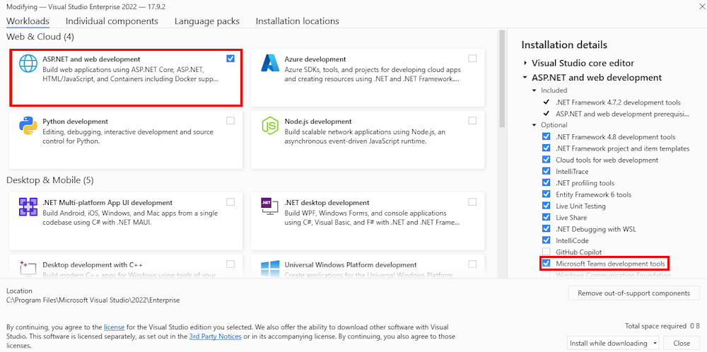

1. In the debug dropdown menu of Visual Studio, select Dev Tunnels > Create A Tunnel (set authentication type to Public) or select an existing public dev tunnel.

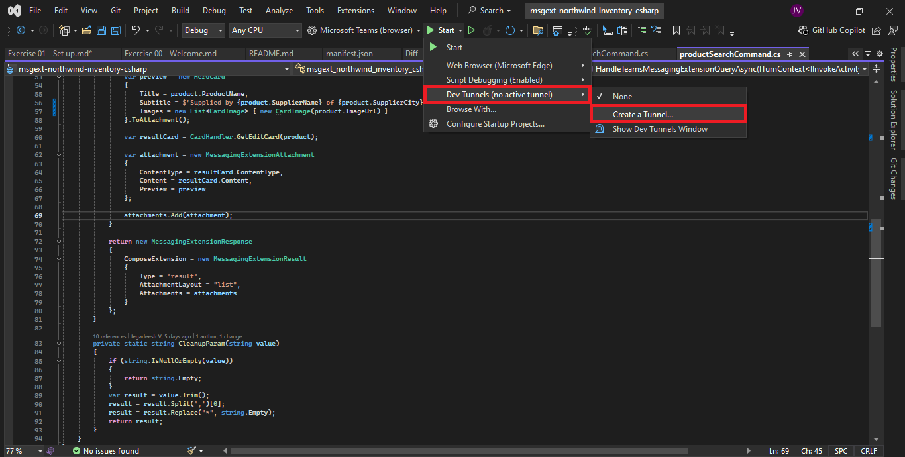

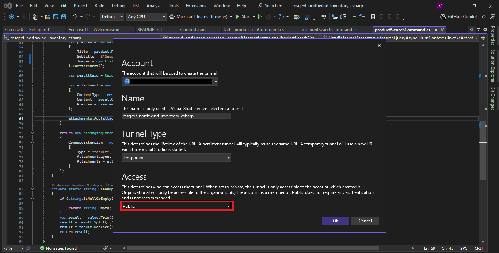

1. In the debug dropdown menu of Visual Studio, select default startup project > **Microsoft Teams (browser)**

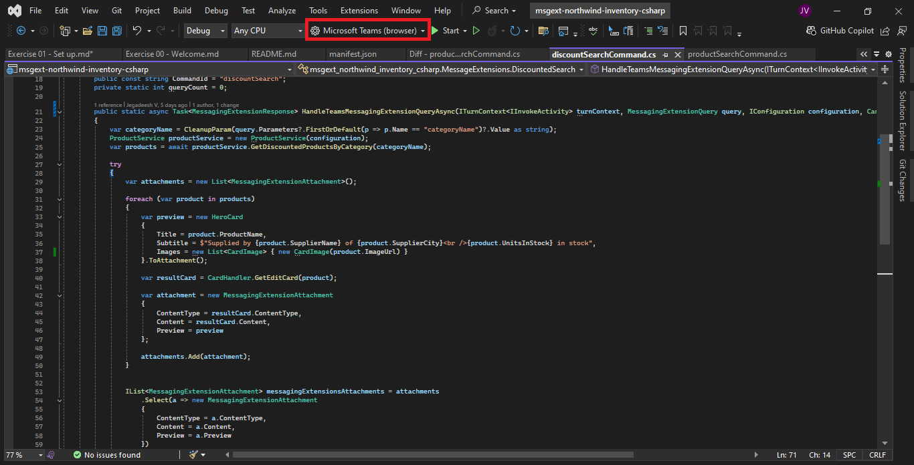

1. In Visual Studio, right-click your **TeamsApp** project and **Select Teams Toolkit > Prepare Teams App Dependencies**

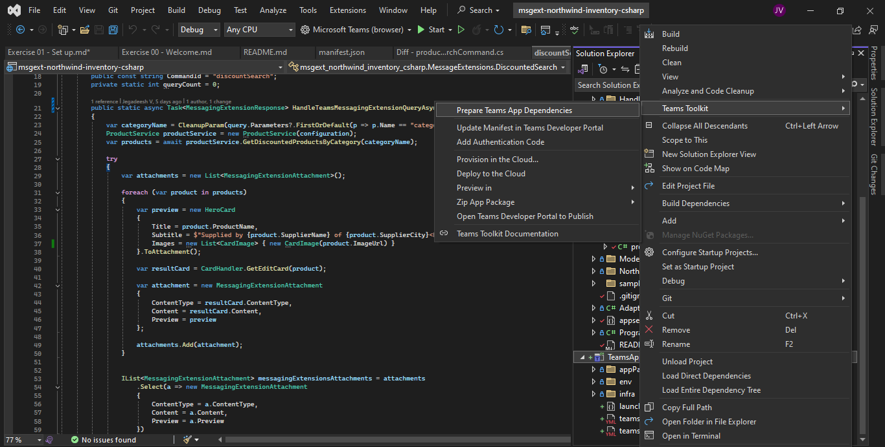

1. Sign in with your Microsoft 365 account where you have permissions to upload custom apps.

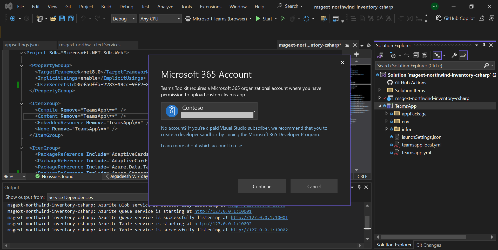

1. Select existing or create a new resource group and subscription. Click **Provision** button.

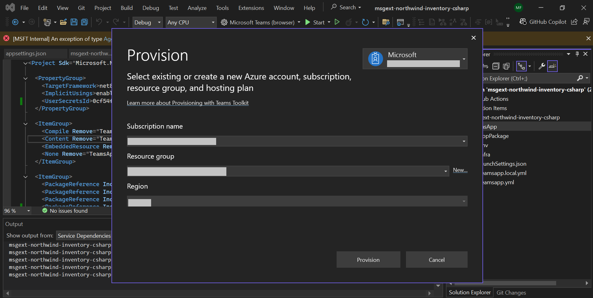

1. Once the provisioning is completed, you will receive a message box as shown below.

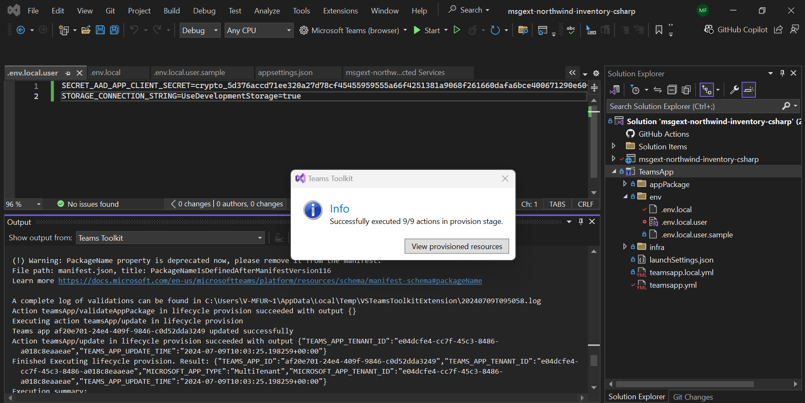

> If you do not have permission to upload custom apps (sideloading), Teams Toolkit will recommend creating and using a Microsoft 365 Developer Program account - a free program to get your own dev environment sandbox that includes Teams.

1. Optional: Obtain a Bing Maps API key. The app works with any string value, but map URLs will be invalid unless you provide a valid API key.

1. Copy the values from ./local.settings.json.sample into your ./local.settings.json file. Ensure that the final file includes these lines.

~~~text
"AzureWebJobsStorage": "UseDevelopmentStorage=true",
"SECRET_BING_MAPS_KEY": "xxxxxxxxxxxxxxxxxxxxxxx"
~~~

1. OPTIONAL: Copy the files from the **/sampleDocs** folder to OneDrive or SharePoint. Add the location of these files in the `file_containers` capability in the declarative copilot (**/appPackage/trey-declarative-copilot.json**).

### Running Azurite from an ASP.NET project

Right-click on "Connected Services" in Solution Explorer and select **Add** from the dropdown menu. Choose **Azure Storage**.

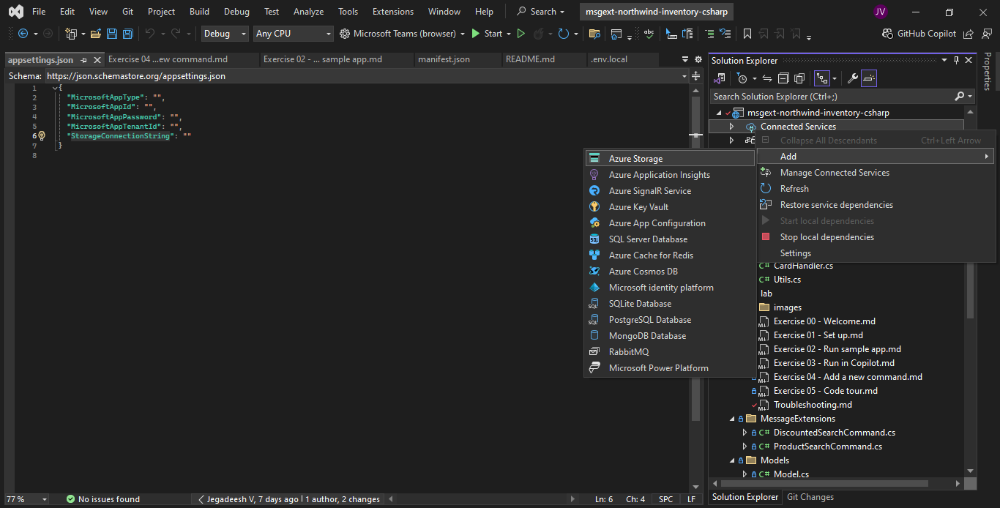

Select service dependency **Storage Azurite emulator(local)** and click **Next**.

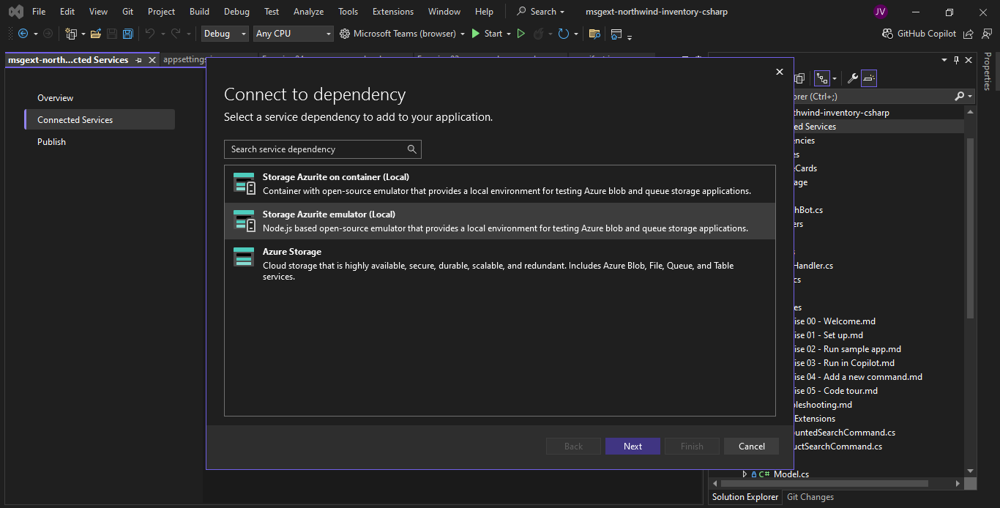

Provide connection string name as **StorageConnectionString** and click **Finish**.

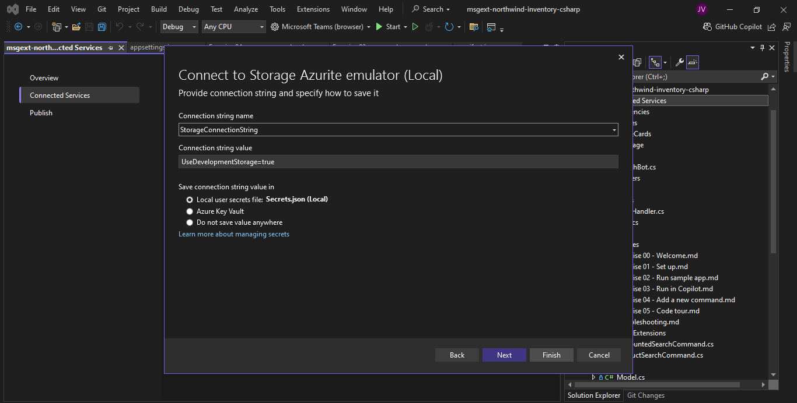

When the configuration completes, select Close, and the Azurite emulator starts automatically. The output looks similar to the following screenshot.

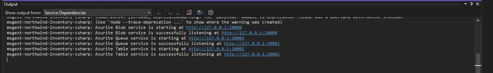

- Enable Multi-Project Launch Profiles

Click the "Debug" menu in Visual Studio and then select "Options".

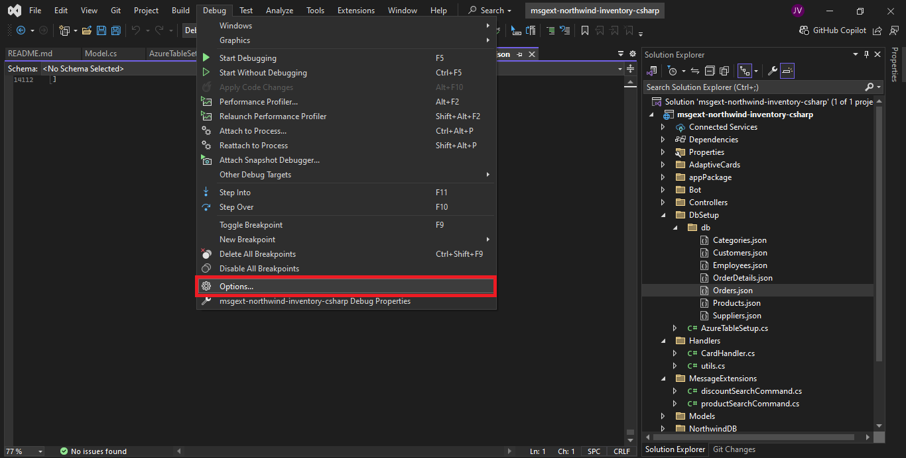

Navigate to Environment > Preview Features and check the checkbox labeled "Enable Multi-Project Launch Profiles".

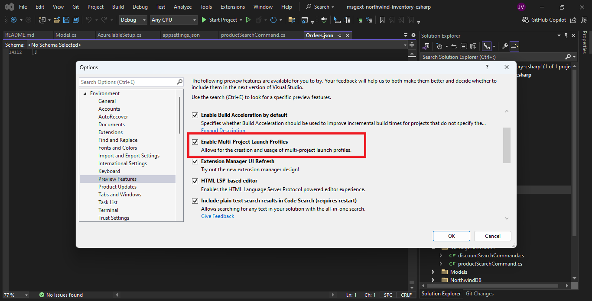

### Running the solution (after each build)

Click F5 to start debugging, or click the start button 1️⃣. Make sure that the debug profile is **Microsoft Teams (browser)** 2️⃣.

2. Wait 5 minutes

3. Go to Copilot; ensure Avalon is enabled with the required flags and settings to run API Plugins

4. Enable the plugin in the Copilot plugin panel. For best results, mention "trey" with each prompt.

## API Summary

 

We have a [Postman collection](https://documenter.getpostman.com/view/5938178/2sA3JJ8hfn) for you to try out the APIs. 
All API operations are prepared with parameters and body pregenerated to make it easier for you to test our GET and POST calls. 

> Make sure you have [Postman desktop](https://www.postman.com/downloads/) to be able to test urls with `localhost` domain. 
Or simply replace part of the URL `http://localhost:7071` with your tunnel/host URL.

#### GET Requests

~~~javascript

 GET /api/me/ - get my consulting profile and projects

GET /api/consultants/ - get all consultants
// Query string params can be used in any combination to filter results
GET /api/consultants/?consultantName=Avery - get consultants with names containing "Avery"
GET /api/consultants/?projectName=Foo - get consultants on projects with "Foo" in the name
GET /api/consultants/?skill=Foo - get consultants with "Foo" in their skills list
GET /api/consultants/?certification=Foo - get consultants with "Foo" in their certifications list
GET /api/consultants/?role=Foo - get consultants who can serve the "Foo" role on a project
GET /api/consultants/?availability=x - get consultants with x hours availability this month or next month

~~~

The above requests all return an array of consultant objects, which are defined in the ApiConsultant interface in /model/apiModel.ts.

~~~javascript
GET /api/projects/ - get all projects
// Query string params can be used in any combination to filter results
GET /api/projects/?projectName=Foo - get projects with "Foo" in the name
GET /api/projects/?consultantName=Avery - get projects where a consultant containing "Avery" is assigned

~~~

The above requests all return an array of project objects, which are defined in the ApiProject interface in /model/apiModel.ts.

#### POST Requests

~~~javascript
POST /api/me/chargeTime - Add hours to project with "Foo" in the name

Request body:
{
  projectName: "foo",
  hours: 5
}
Response body:
{
    status: 200,
    message: "Charged 3 hours to Woodgrove Bank on project \"Financial data plugin for Microsoft Copilot\". You have 17 hours remaining this month";
}

POST /api/projects/assignConsultant - Add consultant to project with "Foo" in the name
Request body:
{
    projectName: "foo",
    consultantName: "avery",
    role: "architect",
    forecast: number
}
Response body:
{
    status: 200
    message: "Added Alice to the \"Financial data plugin for Microsoft Copilot\" project at Woodgrove Bank. She has 100 hours remaining this month.";
}
~~~

## API Design considerations

The process began with a bunch of sample prompts that serve as simple use cases for the service. The API is designed specifically to serve those use cases and likely prompts. In order to make it easier for use in the RAG orchestration, the service:

1. Completes each prompt / use case in a single HTTP request

    * accept names or partial names that might be stated in a user prompt rather than requiring IDs which must be looked up
    * return enough information to allow for richer responses; err on the side of providing more detail including related entities

2. Ensure that parameters, properties, messages, etc. are human readable, as they will be interpreted by a large language model

3. Return all the data Copilot might need to fulfull a user prompt. For example, when retrieving a
consultant, the API has no way to know if the user was seeking the consultant's skills, location, project list, or something else. Thus, the API returns all this information.

4. In GET requests, use the resource that corresponds to the entity the user is asking for. Don't expect Copilot to figure out that some data is buried in another entity.

5. In POST requests, use a command style such as `/me/chargeTime`, as opposed to asking the API to update a data structure

6. Don't expect Copilot to filter data; instead provide parameters and filter it server side. (I have seen some filtering by Copilot however - this is for further study)