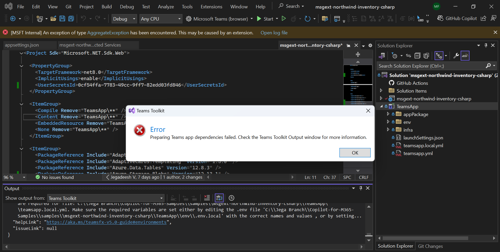
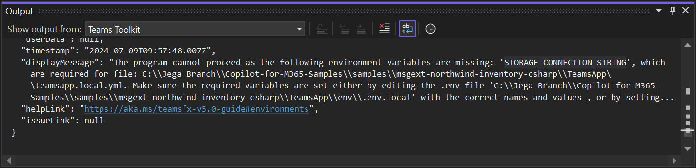
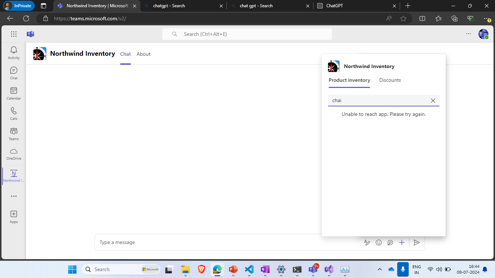
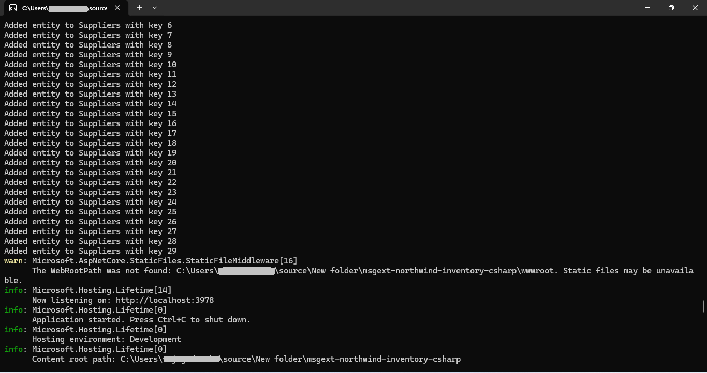

# Building Message Extensions for Microsoft Copilot for Microsoft 365

TABLE OF CONTENTS

* [Welcome](./Exercise%2000%20-%20Welcome.md)
* [Exercise 1](./Exercise%2001%20-%20Set%20up.md) - Set up your development Environment
* [Exercise 2](./Exercise%2002%20-%20Run%20sample%20app.md) - Run the sample Message Extension
* [Exercise 3](./Exercise%2003%20-%20Run%20in%20Copilot.md) - Run the sample as a Copilot plugin
* [Exercise 4](./Exercise%2004%20-%20Code%20tour.md) - Code tour

## Common errors and how to fix them

### App won't start first time

This happens when the environment variable `STORAGE_CONNECTION_STRING` is missing from **.env.local**.
See Exercise 2 Step 1 or just add this text to **.env.local**:

~~~text
STORAGE_CONNECTION_STRING=UseDevelopmentStorage=true
~~~

### The app takes a long time to start after pressing F5 or the debug button

The first time, it's normal for this to take several minutes as the data entries are being added to the Azure data table.

Please make sure you see the project terminal ending with the output shown below before testing testing the sample.

