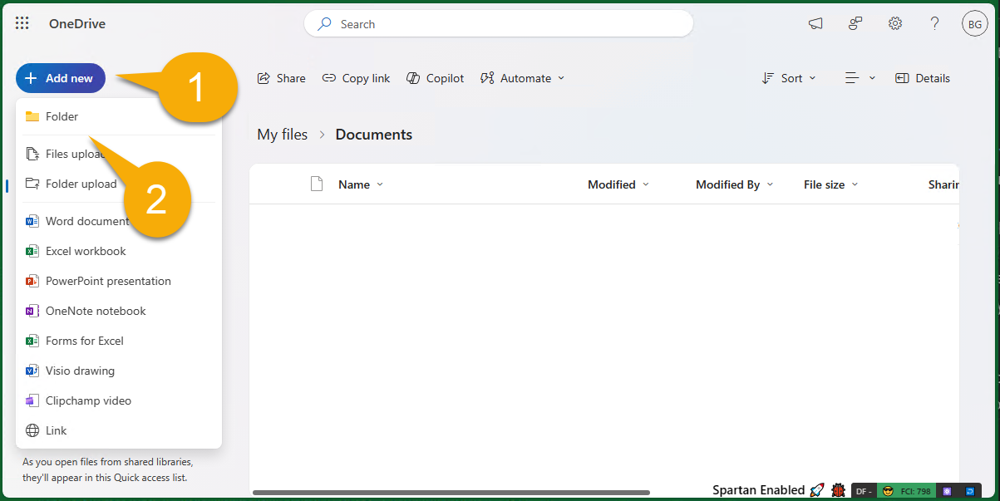
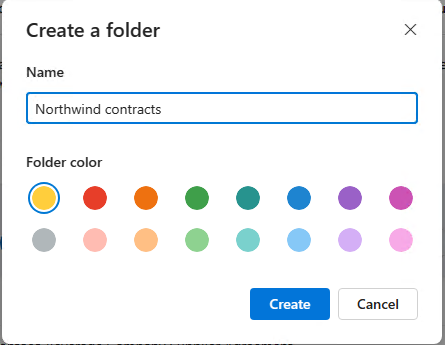
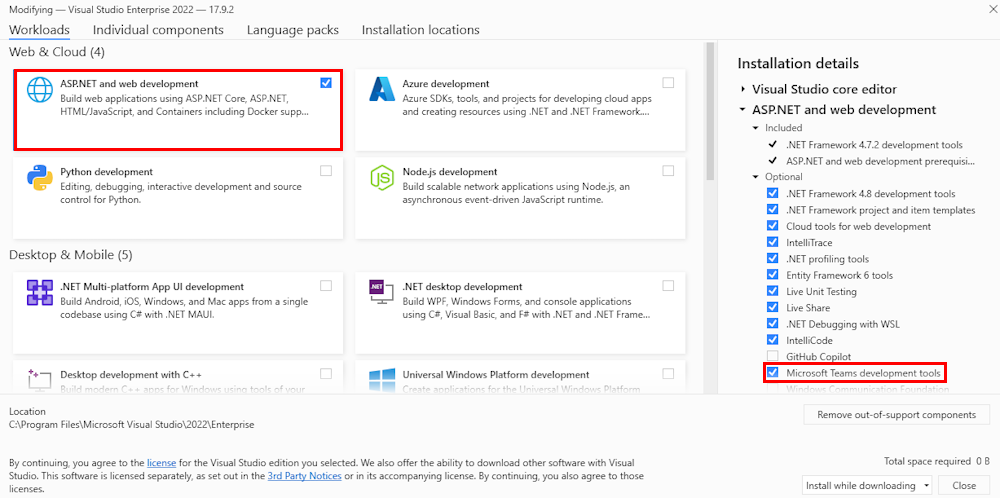

# Building Message Extensions for Microsoft Copilot for Microsoft 365

TABLE OF CONTENTS

* [Welcome](./Exercise%2000%20-%20Welcome.md) 
* Exercise 1 - Set up your development Environment **(THIS PAGE)**
* [Exercise 2](./Exercise%2002%20-%20Run%20sample%20app.md) - Run the sample as a Message Extension
* [Exercise 3](./Exercise%2003%20-%20Run%20in%20Copilot.md) - Run the sample as a Copilot plugin

## Exercise 1 - Set up your development environment

## Step 1 - Install prerequisites

**To complete these exercises, you will need a login to a Microsoft 365 subscription with permission to upload applications. The following instructions will explain how to get one.**

**To complete Exercise 3, the account must also be licensed for Microsoft Copilot for Microsoft 365.**

If this is a new tenant, it's a good idea to log into the [Microsoft 365 page](https://office.com) at [https://office.com](https://office.com) before beginning. Depending on how the tenant is configured, you may be asked to set up multi-factor authentication. Ensure you can access Microsoft Teams and Microsoft Outlook before proceeding.

Please install the following on your computer:

1. [Visual Studio](https://visualstudio.microsoft.com/) (latest version)

2. [Azure Storage Explorer](https://azure.microsoft.com/products/storage/storage-explorer/) (OPTIONAL) - Download this if you want to view and edit the Northwind database used in this sample

## Step 2 - Download the sample code

Please [clone](https://github.com/OfficeDev/Copilot-for-M365-Plugins-Samples.git) or [download](https://github.com/OfficeDev/Copilot-for-M365-Plugins-Samples.git) the sample repository: [https://github.com/OfficeDev/Copilot-for-M365-Plugins-Samples/](https://github.com/OfficeDev/Copilot-for-M365-Plugins-Samples/).

Within the cloned or downloaded repository, navigate to the **samples/msgext-northwind-inventory-csharp** folder. These labs will refer to this as your "working folder" since this is where you'll be working.

## Step 3 - Copy sample documents to your test user's OneDrive

The sample application includes some documents for Copilot to reference during the labs. In this step you will copy these files to your user's OneDrive so Copilot can find them. Depending on how the tenant is set up, you may be asked to set up multi-factor authentication as part of this process.

Open your browser and browse to Microsoft 365 ([https://www.office.com/](https://www.office.com/)). Log in using the Microsoft 365 account you will be using throughout the lab. You may be asked to set up multi-factor authentication.

Using the "waffle" menu in the upper left corner of the page 1️⃣ , navigate to the OneDrive application within Microsoft 365 2️⃣ .

Within OneDrive, navigate to "My Files" 1️⃣ . If there's a documents folder, click into that as well. If not, you can work directly within the "My Files" location.

Now click "Add new" 1️⃣ and "Folder" 2️⃣ to create a new folder.

Name the folder "Northwind contracts" and click "Create".

Now, from within this new folder, click "Add new" 1️⃣  again but this time click "Files upload" 2️⃣ .

Now browse to the **sampleDocs** folder within your working folder. Highlight all the files 1️⃣ and click "OK" 2️⃣  to upload them all.

By doing this step early, there's a good chance that the Microsoft 365 search engine will have discovered them by the time you're ready for them.

## Step 4 - Install and set up Teams Toolkit for Visual Studio Code

Install Teams Toolkit for Visual Studio [Teams Toolkit extension](https://learn.microsoft.com/en-us/microsoftteams/platform/toolkit/toolkit-v4/install-teams-toolkit-vs?pivots=visual-studio-v17-7)

In the debug dropdown menu of Visual Studio, select Dev Tunnels > Create A Tunnel (set authentication type to Public) or select an existing public dev tunnel.

In the debug dropdown menu of Visual Studio, select default startup project > **Microsoft Teams (browser)**

In Visual Studio, right-click your **TeamsApp** project and **Select Teams Toolkit > Prepare Teams App Dependencies**

Using the extension, sign in with your Microsoft 365 account where you have permissions to upload custom apps.

Select **Debug > Start Debugging** or **F5** to run the menu in Visual Studio.In the browser that launches, select the **Add** button to install the app to Teams.

> If you do not have permission to upload custom apps (sideloading), Teams Toolkit will recommend creating and using a Microsoft 365 Developer Program account - a free program to get your own dev environment sandbox that includes Teams.

## Congratulations

You have completed Exercise 1.
Please proceed to [Exercise 2](./Exercise%2002%20-%20Run%20sample%20app.md) in which you will run the sample application as a message extension.
