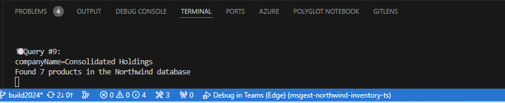
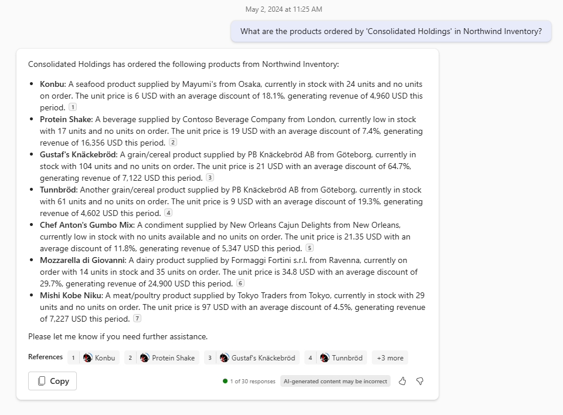

# Building plugins for Microsoft Copilot for Microsoft 365

TABLE OF CONTENTS

* [Welcome](./Exercise%2000%20-%20Welcome.md) 
* [Exercise 1](./Exercise%2001%20-%20Set%20up.md) - Set up your development Environment 
* [Exercise 2](./Exercise%2002%20-%20Run%20sample%20app.md) - Run the sample as a Message Extension
* [Exercise 3](./Exercise%2003%20-%20Run%20in%20Copilot.md) - Run the sample as a Copilot plugin
* Exercise 4 - Add a new command **(THIS PAGE)**
* [Exercise 5](./Exercise%2005%20-%20Code%20tour.md) - Code tour

## Exercise 4 - Add a new command 

In this exercise, you will enhance the Teams Message Extension (ME) / Copilot plugin by adding a new command. While the current message extension effectively provides information about products within the Northwind inventory database, it does not provide information related to Northwind’s customers. Your task is to introduce a new command associated with an API call that retrieves products ordered by a customer name specified by the user. This exercise assumes you have completed at least exercises 1 and 2. It's fine to skip Exercise 3 in case you don't have a Copilot for Microsoft 365 license.

To do this you'll complete five tasks.
1. **Extend the Message Extension / plugin User Interface** by modifying the Teams app manifest. This includes introducing a new command: **"companySearch"**. Note the UI for the Message Extension is an adaptive card where for Copilot it is text input and output in Copilot chat.
2. **Create a handler for the 'companySearch' command**. This will parse the query string passed in from the message routing code, validate the input and call the product search by company API. This step will also populate an adaptive card with the returned product list which will be displayed in the ME or Copilot chat UI.
3. Update the command **routing** code to route the new command to the handler created in the previous step. You'll do this by extending the method called by the Bot Framework when users query the Northwind database (**handle_teams_messaging_extension_query**). 
4. **Implement Product Search by Company** that returns a list of products ordered by that company.
5. **Run the app** and search of products that were purchased by a specified company.

# Step 1 - Extend the Message Extension / plugin User Interface 

1. Open **manifest.json** and add the following json immediately after the `discountSearch` command. Here you're adding to the `commands` array which defines the list of commands supported by the ME / plugin.

```json
{
    "id": "companySearch",
    "context": [
        "compose",
        "commandBox"
    ],
    "description": "Given a company name, search for products ordered by that company",
    "title": "Customer",
    "type": "query",
    "parameters": [
        {
            "name": "companyName",
            "title": "Company name",
            "description": "The company name to find products ordered by that company",
            "inputType": "text"
        }
    ]
}
```
```
Note: The "id" is the connection between the UI and the code. This value is defined as COMMAND_ID in the bot\search_bot.py files. See how each of these files has a unique COMMAND_ID that corresponds to the value of "id".
```

# Step 2 - Create a handler for the 'companySearch' command
We will use a lot of the code created for the other handlers. 

1. In VS code copy '**product_search_command.py**' and paste into the same folder to create a copy. Rename this file **customer_search_command.py**.

2. Change line 8 to:
```python
COMMAND_ID = 'companySearch'
```

2. Replace the content of **handle_teams_messaging_extension_query** with:
```python
    global query_count
    company_name = None

    # Validate the incoming query, making sure it's the 'companySearch' command
    # The value of the 'companyName' parameter is the company name to search for
    if len(query.get("parameters", [])) == 1 and query["parameters"][0].get("name") == "companyName":
        values = query["parameters"][0].get("value", "").split(',')
        company_name = values[0] if values else None
    else:
        company_name = cleanup_param(
            next((param.get("value") for param in query.get("parameters", []) if param.get("name") == 'companyName'), None)
        )

    print(f'🍽️ Query #{query_count + 1}:\ncompanyName={company_name}')
    query_count += 1

    products = await search_products_by_customer(company_name)

    print(f'Found {len(products)} products in the Northwind database')

    attachments = []
    for product in products:
        hero_card = HeroCard(
            title=product.get("ProductName"),
            tap=CardAction(type="invoke", value=product),
            text=f'Customer: {company_name}',
            images=[CardImage(url=product.get("ImageUrl"))]
        )

        result_card = card_handler.get_edit_card(product)
        attachment = MessagingExtensionAttachment(
            content_type=CardFactory.content_types.hero_card,
            content=result_card,
            preview=hero_card
        )
        attachments.append(attachment)

    return MessagingExtensionResponse(
        compose_extension=MessagingExtensionResult(
            type="result",
            attachment_layout="list",
            attachments=attachments
        )
    )
```
Note that you will implement `search_products_by_customer` in Step 4.

# Step 3 - Update the command routing
In this step you will route the `companySearch` command to the handler you implemented in the previous step.

2. Open **search_bot.py** and add the following. Underneath this line:
```python
from message_extensions import product_search_command, discounted_search_command
```
Add this line:
```python
from message_extensions import customer_search_command
```
3. Underneath this statement:
```python
    if query.command_id == product_search_command.COMMAND_ID:
        return await product_search_command.handle_teams_messaging_extension_query(context, query)
```
Add this statement:
```python
    if query.command_id == customer_search_command.COMMAND_ID:
        return await customer_search_command.handle_teams_messaging_extension_query(context, query)
```
```text
Note that in the UI-based operation of the Message Extension / plugin, this command is explicitly called. However, when invoked by Microsoft 365 Copilot, the command is triggered by the Copilot orchestrator.
```
# Step 4 - Implement Product Search by Company
 You will implement a product search by Company name and return a list of the company's ordered products. Find this information using the tables below:

| Table         | Find        | Look Up By    |
| ------------- | ----------- | ------------- |
| Customer      | Customer Id | Customer Name |
| Orders        | Order Id    | Customer Id   |
| OrderDetail | Product       | Order Id      |

Here's how it works: 
Use the Customer table to find the Customer Id with the Customer Name. Query the Orders table with the Customer Id to retrieve the associated Order Ids. For each Order Id, find the associated products in the OrderDetail table. Finally, return a list of products ordered by the specified company name.

1. Open **.\northwindDB\products.py**

2. Update the `import` statement on line 5 to include OrderDetail, Order and Customer. It should look as follows
```python
from .model import Product, ProductEx, Supplier, Category, OrderDetail, Order, Customer
```
3. Add the new method `search_products_by_customer()`

add the method:
```python
async def search_products_by_customer(company_name: str) -> List[ProductEx]:
    # Fetch all products
    result = await get_all_products_ex()
    
    # Load customer data
    customers = await load_reference_data(Settings.TABLE_NAME['CUSTOMER'])
    
    # Find customer ID matching the company name
    customer_id = ""
    for customer in customers.values():
        if company_name.lower() in customer.get('CompanyName', '').lower():
            customer_id = customer.get('CustomerID', '')
            break
    
    if not customer_id:
        return []

    # Load order data
    orders = await load_reference_data(Settings.TABLE_NAME['ORDER'])
    order_details = await load_reference_data(Settings.TABLE_NAME['ORDER_DETAIL'])
    
    # Build an array of orders for the given customer ID
    customer_orders = [order for order in orders.values() if order.get('CustomerID') == customer_id]
    
    # Build an array of order details for the customer orders
    customer_order_details = [
        order_detail for order_detail in order_details.values()
        if any(order.get('OrderID') == order_detail.get('OrderID') for order in customer_orders)
    ]
    
    # Filter products by the ProductID in the customerOrderDetails array
    filtered_products = [
        product for product in result
        if any(order_detail.get('ProductID') == product['ProductID'] for order_detail in customer_order_details)
    ]
    
    return filtered_products
```
# Step 5 - Run the App! Search for product by company name

Now you're ready to test the sample as a plugin for Copilot for Microsoft 365.

1. Delete the 'Northwest Inventory' app in Teams. This step is necessary since you are updating the manifest. Manifest updates require the app to be reinstalled. The cleanest way to do this is to first delete it in Teams.

    a. In the Teams sidebar, click on the three dots (...) 1️⃣. You should see Northwind Inventory 2️⃣ in the list of applications.

    b. Right click on the 'Northwest Inventory' icon and select uninstall 3️⃣.

    

2. Like you did in [Exercise 2 - Run the sample as a Copilot plugin](./Exercise%2003%20-%20Run%20in%20Copilot.md), start the app in Visual Studio Code using the **Debug in Teams (Edge)** profile.

3. In Teams click on **Chat** and then **Copilot**. Copilot should be the top-most option.
4. Click on the **Plugin icon** and select **Northwind Inventory** to enable the plugin.
5. Enter the prompt: 
```
What are the products ordered by 'Consolidated Holdings' in Northwind Inventory?
```
The Terminal output shows Copilot understood the query and executed the `companySearch` command, passing company name extracted by Copilot.


Here's the output in Copilot:


Here are other prompts to try:
```
What are the products ordered by 'Consolidated Holdings' in Northwind Inventory? Please list the product name, price and supplier in a table.
```

Of course, you can test this new command also by using the sample as a Message Extension, like we did in [Exercise 2](./Exercise%2002%20-%20Run%20sample%20app.md). 

1. In the Teams sidebar, move to the **Chats** section and pick any chat or start a new chat with a colleague.
2. Click on the + sign to access to the Apps section.
3. Pick the Northwind Inventory app.
4. Notice how now you can see a new tab called **Customer**.
5. Search for **Consolidated Holdings** and see the products ordered by this company. They will match the ones that Copilot returned you in the previous step.


## Congratulations
You've completed the exercise! Please proceed to [Exercise 5](./Exercise%2005%20-%20Code%20tour.md), in which you will explore the plugin source code and adaptive cards.

