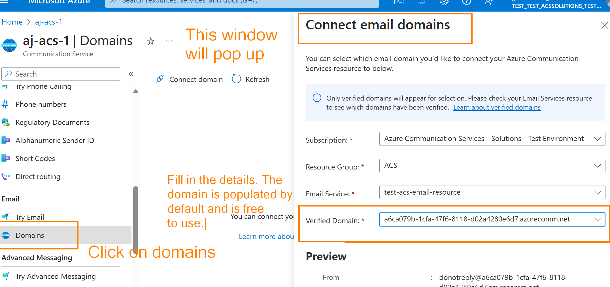
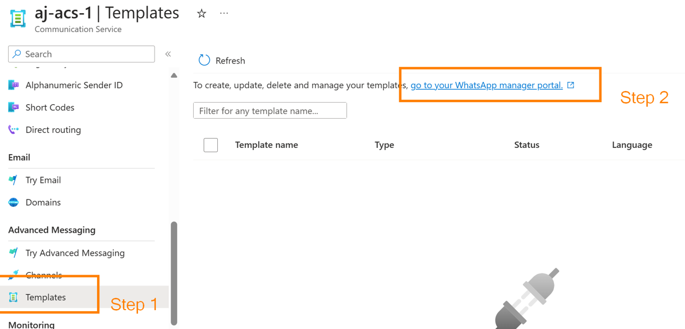
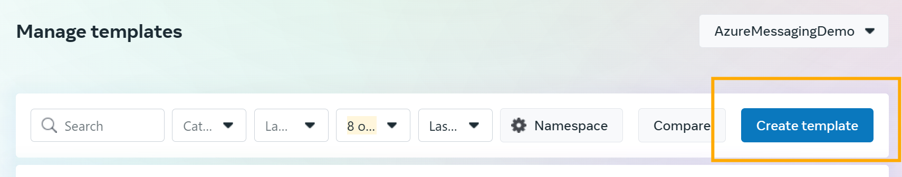
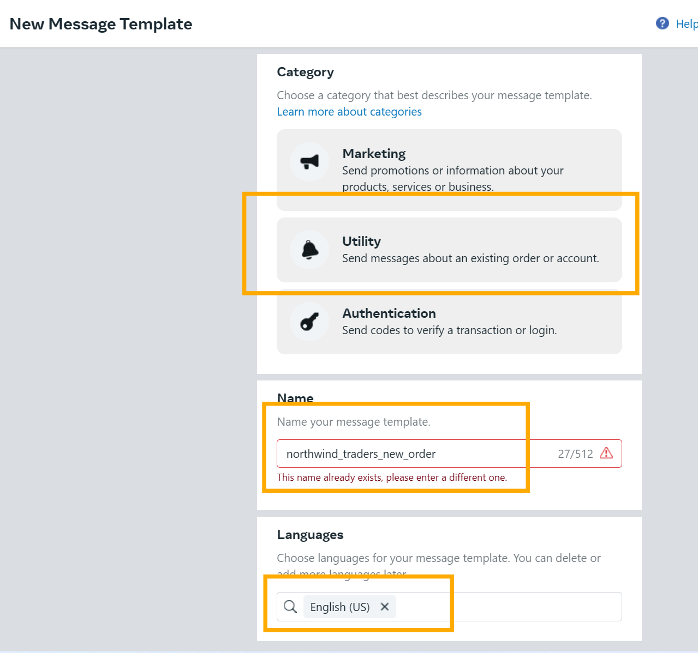
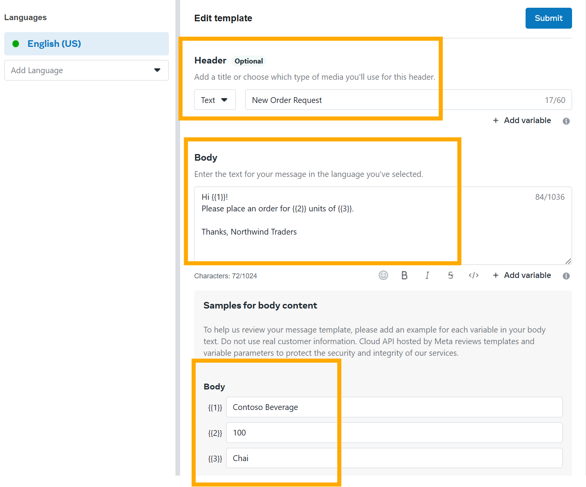
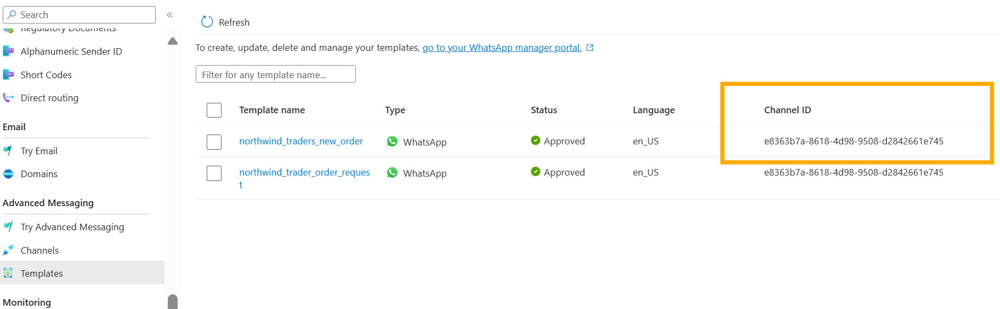
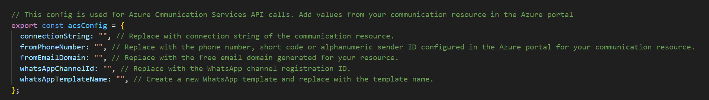

# Building Message Extensions for Microsoft Copilot for Microsoft 365

TABLE OF CONTENTS

## Exercise 1.1 - Set up your development environment for being able to send SMS, Email and WhatsApp from your Teams Message Extension.

**To complete these labs, you will need an Azure subscription. You can use an already existing one or [create a free Azure account here](https://signup.azure.com/signup?offer=ms-azr-0044p&appId=102&ref=&redirectURL=https:%252F%252Fazure.microsoft.com%252Fget-started%252Fwelcome-to-azure%253Ficid%253Dacom_free&l=en-us&srcurl=https:%252F%252Fazure.microsoft.com%252Ffree%252Fsearch%252F%253Fef_id%253D_k_976d87fc1af712a73f0ce1b69e4019f7_k_%2526ocid%253Daidcmm5edswduu_sem__k_976d87fc1af712a73f0ce1b69e4019f7_k_%2526msclkid%253D976d87fc1af712a73f0ce1b69e4019f7). The free account sign up will get you $200 of Azure credit. You will require a debit or a credit card on file to get started. Don't worry if you see a temporary authorization on your card, you won’t be charged unless you move to pay-as-you-go pricing once your trial expires.**

## Step 1 - Create a Communication Services resource

To create a Communication Services resource, follow these steps:

1. Open the Azure portal (https://portal.azure.com) and sign in with your Azure account.
2. Click on the "+ Create a resource" button.
3. Search for "Communication Services" and select it from the search results.
4. Click on the "Create" button.
5. Fill in the required information for the resource, such as the subscription, resource group, and resource name.
6. Choose the desired pricing tier and region for the resource.
7. Review the terms and conditions, and then click on the "Create" button to create the resource.
8. Once a resource is created, click on Keys in the side blade and copy the connection string. You will need it for the confog later.

*Once the Communication Services resource is created, you can proceed to the next steps for setting up communication channels following Step 2, 3 and 4. Note that you can choose to set one or more channels. Setting up all three channels is not a pre-requisite to try out the sample. WhatsApp has more steps as compared to SMS and Email as you need to register a WhatsApp business account with Meta. Don't worry, they are easy to do and we will guide you step by step.
*

**Cost considerations**
Using SMS will have a small fee associated with acquiring a phone number (~$2 per month for leasing a number and $0.001 per message). Email and WhatsApp set ups are free with a tiny fee of $0.00025/Email and $0.005/WhatsApp message. You would have enough free Azure credits if you sign up for the free trial.
[Azure Communication Services Pricing](https://azure.microsoft.com/en-us/pricing/details/communication-services/) 

## Step 2 - Set up an Email domain for sending emails

1. [Set up the email service](https://aka.ms/Mech-EmailService)
2. Navigate to your Communication Services resource.
2. In the left-hand menu, click on "Email" under "Communication Channels".
4. Click on the "Domains" button to add a new email domain.
5. Select options from the drop down.
6. The free default Azure domain will be pre-populated. We will use that for this sample.
7. Copy the number. We'll use it in the config later.
8. You have an option to create a custom domain for your app/business and add it here. It requires additional verification steps. 

## Step 3 - Get a phone number for sending SMS

To get a phone number for sending SMS, follow these steps:

1. Go to your Communication resource in the Azure portal.
2. Navigate to the "Phone numbers" section.
3. Click on the "Add" button to add a new phone number.
4. Follow the prompts to select the desired country and area code for the phone number.
5. Choose the type of phone number (e.g., toll-free or geographic) and any additional options.
6. Review the pricing details and click on the "Buy" button to purchase the phone number.
7. Copy the number. We'll use it in the config later.

## Step 4 - Set up WhatsApp channel
Through Azure Communication Services, you can programmatically send WhatsApp messages to other users/customers through your WhatsApp business account.

1. [Connect your WhatsApp business account with the communication resource](https://aka.ms/northwind-whatsApp-1). If you do not have a business set up, you could create a Facebook page with business category and connect your existing phone number with it. Alternatively, you can connect an Azure Communication Services number as your business number. 
2. A WhatsApp business conversation needs to start with a templated message. We'll guide you to create a new template for placing an order.

Log in using the Facebook account connected to your WhatsApp Business account.

3. Go back to the Azure portal where your communication resource page is open. Your WhatsApp template would show up under Advanced Messaging -> Templates. Copy the channel Id, you will need it for the config. You will be able to use this template only after it is approved by Meta. Approval usually takes less than 10 minutes.

## Step 5 - Update the application config
After you set up all or some of the communication channels, update the config file with the strings

   - Open the ./src/config.ts and add the strings that you collected while following the steps. If you skipped any of the channels, then leave the corresponding configuration as "". For example, if you did not complete Step 4, leave the WhatsApp configurations empty. Only the channels you provide the config values for will work for your app.
   

## Congratulations

You have completed Exercise 1.1.
Please proceed to [Exercise 2](./Exercise%2002%20-%20Run%20sample%20app.md) in which you will run the sample application.
