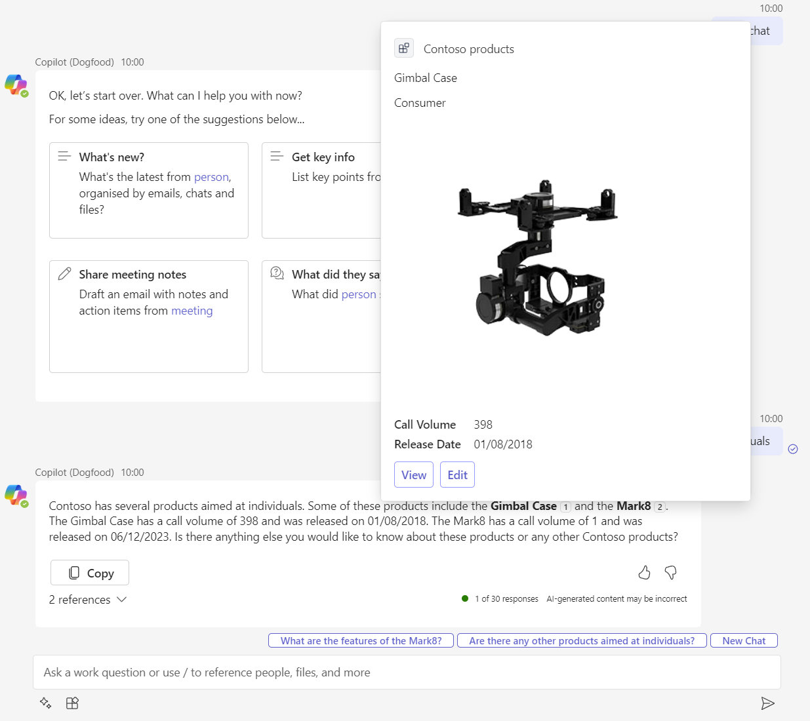

# Product support message extension sample

This sample implements a Teams message extension that can be used as a plugin for Microsoft Copilot for Microsoft 365. The message extension allows users to query items in the Products list in the [Product support](https://lookbook.microsoft.com/details/81e2fee3-02a0-427b-af8b-8c7f42010fde) SharePoint Online team site via Microsoft Graph.

## Prerequisites

- [Visual Studio 2022 17.7+](https://visualstudio.microsoft.com)
- [Teams Toolkit](https://learn.microsoft.com/microsoftteams/platform/toolkit/toolkit-v4/install-teams-toolkit-vs?pivots=visual-studio-v17-7)
- Azure subscription
- You will need a Microsoft work or school account with [permissions to upload custom Teams applications](https://learn.microsoft.com/microsoftteams/platform/concepts/build-and-test/prepare-your-o365-tenant#enable-custom-teams-apps-and-turn-on-custom-app-uploading). The account will also need a Microsoft Copilot for Microsoft 365 license to use the extension in Copilot.

## Minimal path to awesome

### 1. Prepare SharePoint Online

- Using [SharePoint look book](https://lookbook.microsoft.com) service, provision a new SharePoint Online team site using the [Product support](https://lookbook.microsoft.com/details/81e2fee3-02a0-427b-af8b-8c7f42010fde) template
- In the Products list, [create indexes](https://support.microsoft.com/en-us/office/add-an-index-to-a-list-or-library-column-f3f00554-b7dc-44d1-a2ed-d477eac463b0) on the `Title` and `RetailCategory` columns

> NOTE: If you can't use the SharePoint look book service, you can find the source files to create it manually in the [SharePoint look book repository](https://github.com/SharePoint/sp-dev-provisioning-templates/tree/master/tenant/productsupport)

### 2. Prepare Azure

- Open [Azure portal](https://portal.azure.com) in a web browser
- Create a new resource group with the name `rg-msgext-product-support-sso-csharp-local`

### 3. Prepare and run project

- Open solution in Visual Studio
- In `env\samples` folder, copy the contents to the parent folder (`env`)
- In `env` folder, rename all files, removing `.sample` from the file names
- In `env` folder, open `env\env.local`
- Update `AZURE_SUBSCRIPTION_ID` with the ID of the Azure subscription you created the resource group in
- Update `SPO_HOSTNAME`, replacing `<tenantname>` with the hostname of your SharePoint Online tenant
- Create a [public dev tunnel](https://learn.microsoft.com/microsoftteams/platform/toolkit/toolkit-v4/debug-local-vs?pivots=visual-studio-v17-7#set-up-dev-tunnel-only-for-bot-and-message-extension)
- Run [Prepare Teams apps dependencies](https://learn.microsoft.com/microsoftteams/platform/toolkit/toolkit-v4/debug-local-vs?pivots=visual-studio-v17-7#set-up-your-teams-toolkit)
- Press <kbd>F5</kbd> and follow the prompts

> NOTE: When Teams Toolkit prepares the app it will provision a new Azure AI Bot Service into the resource group which uses the F0 SKU which grants unlimited messages to be sent to standard channels, this includes Microsoft Teams and Microsoft 365 channel (Outlook and Copilot) and does not incur a cost.

### 3. Test

- In Microsoft Teams, open the M365 Chat app
- Open the prompts flyout and enable `Product support` plugin
- Enter `Find Contoso products aimed at individuals` in the message box and press <kbd>Enter</kbd>
- Copilot will respond with a message saying that it cannot find any information about a Contoso products aimed at individuals in the enterprise search results
- Click `Sign in to Contoso products` to start the sign-in flow and consent to the permissions requested by the app
- Enter `Find Contoso products aimed at individuals` in the message box and send it
- Copilot will respond with a message referencing Contoso consumer products
- Hover over a reference to view an Adaptive Card with the product details. The card contains a photo and action buttons to view either view the SharePoint List Item in the Product support team site or edit the product details from within Copilot
- Select `Edit`, you will recieve a popup which will dissappear, this also results in the adaptive card dissapearing. This popup is caused by a second sign-in required to get an access token for Microsoft Graph from the action handler which uses the Microsoft Teams bot channel
- Hover over a reference again and select `Edit`, this time you will see a form appear to update the product details
- Update the product details in the form and select `Save`, the card will then show the updated product details

