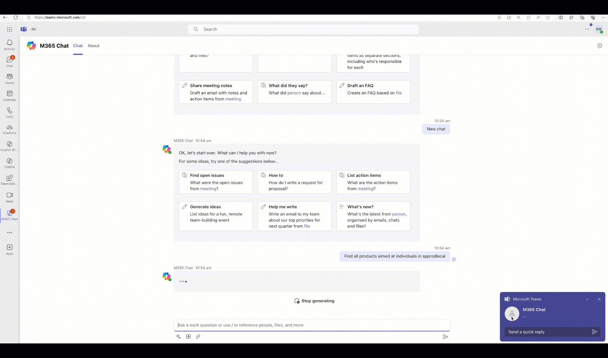

# Overview Contoso Products message extension sample - TS

This sample implements a Teams message extension that can be used as a plugin for Copilot for Microsoft 365. The message extension allows users to query items in the Products list in the Product support SharePoint Online team site via Microsoft Graph. 

> 💡 This is the TypeScript version of the OG .NET [Product support message extension sample](https://github.com/OfficeDev/Copilot-for-M365-Plugins-Samples/tree/main/samples/msgext-product-support-sso-csharp)

## Get started with the template

> **Prerequisites**
>
> To run the template in your local dev machine, you will need:
>
> - [Node.js](https://nodejs.org/), supported versions: 18
> - A [Microsoft 365 account for development](https://docs.microsoft.com/microsoftteams/platform/toolkit/accounts)
> - [Set up your dev environment for extending Teams apps across Microsoft 365](https://aka.ms/teamsfx-m365-apps-prerequisites)
> - [Teams Toolkit Visual Studio Code Extension](https://aka.ms/teams-toolkit) version 5.0.0 and higher 
> - Azure subscription
> - You will need a Microsoft work or school account with [permissions to upload custom Teams applications](https://learn.microsoft.com/microsoftteams/platform/concepts/build-and-test/prepare-your-o365-tenant#enable-custom-teams-apps-and-turn-on-custom-app-uploading). The account will also need a Microsoft Copilot for Microsoft 365 license to use the extension in Copilot.

## Minimal path to awesome

### Prepare SharePoint Online

- Using [SharePoint look book](https://lookbook.microsoft.com) service, provision a new SharePoint Online team site using the [Product support](https://lookbook.microsoft.com/details/81e2fee3-02a0-427b-af8b-8c7f42010fde) template
- In the Products list, [create indexes](https://support.microsoft.com/en-us/office/add-an-index-to-a-list-or-library-column-f3f00554-b7dc-44d1-a2ed-d477eac463b0) on the `Title` and `RetailCategory` columns

> NOTE: If you can't use the SharePoint look book service, you can find the source files to create it manually in the [SharePoint look book repository](https://github.com/SharePoint/sp-dev-provisioning-templates/tree/master/tenant/productsupport)

### Prepare and run project

- Clone this repo and open the root folder in VSCode
- In `env` folder copy the contents of `.env.sample` file and create a file with name `.env.local` and paste the contents to it. 
- In `env` folder copy the contents of `.env.sampleuser` file and create a file with name `.env.local.user` and paste the contents to it. 
- Update `AZURE_SUBSCRIPTION_ID` in file `.env.local` with the ID of the Azure subscription you created the resource group in.
- Update `SPO_HOSTNAME` in file `.env.local`, replacing `<tenantname>` with the hostname of your SharePoint Online tenant.
- Press <kbd>F5</kbd> and follow the prompts.

> NOTE: When Teams Toolkit prepares the app it will provision a new Azure AI Bot Service into the resource group which uses the F0 SKU which grants unlimited messages to be sent to standard channels, this includes Microsoft Teams and Microsoft 365 channel (Outlook and Copilot) and does not incur a cost.

### Test 

- In Microsoft Teams, open the Copilot app
- Open the prompts flyout and enable `Contoso products` plugin
- Enter `Find Contoso products aimed at individuals` in the message box and press <kbd>Enter</kbd>
- Copilot will respond with a message saying that it cannot find any information about a Contoso products aimed at individuals in the enterprise search results
- Click `Sign in to Contoso products` to start the sign-in flow and consent to the permissions requested by the app
- Enter `Find Contoso products aimed at individuals` in the message box and send it
- Copilot will respond with a message referencing Contoso consumer products
- Hover over a reference to view an Adaptive Card with the product details and photo.
- You can select the `Take action` button to edit the details and confirm by selecting `Save`
- The card refreshes and the data is successfully saved.

## What's included in the template

| Folder        | Contents                                     |
| ------------- | -------------------------------------------- |
| `.vscode/`    | VSCode files for debugging                   |
| `appPackage/` | Templates for the Teams application manifest |
| `env/`        | Environment files                            |
| `infra/`      | Templates for provisioning Azure resources   |
| `src/`        | The source code for the search application   |

The following files can be customized and demonstrate an example implementation to get you started.

| File               | Contents                                                                                       |
| ------------------ | ---------------------------------------------------------------------------------------------- |
| `src/searchApp.ts` | Handles the business logic for this app template to query npm registry and return result list. |
| `src/index.ts`     | `index.ts` is used to setup and configure the Message Extension.                               |

The following are Teams Toolkit specific project files. You can [visit a complete guide on Github](https://github.com/OfficeDev/TeamsFx/wiki/Teams-Toolkit-Visual-Studio-Code-v5-Guide#overview) to understand how Teams Toolkit works.

| File                 | Contents                                                                                                                                  |
| -------------------- | ----------------------------------------------------------------------------------------------------------------------------------------- |
| `teamsapp.yml`       | This is the main Teams Toolkit project file. The project file defines two primary things: Properties and configuration Stage definitions. |
| `teamsapp.local.yml` | This overrides `teamsapp.yml` with actions that enable local execution and debugging.                                                     |

## Extend the template

Following documentation will help you to extend the template.

- [Add or manage the environment](https://learn.microsoft.com/microsoftteams/platform/toolkit/teamsfx-multi-env)
- [Create multi-capability app](https://learn.microsoft.com/microsoftteams/platform/toolkit/add-capability)
- [Add single sign on to your app](https://learn.microsoft.com/microsoftteams/platform/toolkit/add-single-sign-on)
- [Access data in Microsoft Graph](https://learn.microsoft.com/microsoftteams/platform/toolkit/teamsfx-sdk#microsoft-graph-scenarios)
- [Use an existing Microsoft Entra application](https://learn.microsoft.com/microsoftteams/platform/toolkit/use-existing-aad-app)
- [Customize the Teams app manifest](https://learn.microsoft.com/microsoftteams/platform/toolkit/teamsfx-preview-and-customize-app-manifest)
- Host your app in Azure by [provision cloud resources](https://learn.microsoft.com/microsoftteams/platform/toolkit/provision) and [deploy the code to cloud](https://learn.microsoft.com/microsoftteams/platform/toolkit/deploy)
- [Collaborate on app development](https://learn.microsoft.com/microsoftteams/platform/toolkit/teamsfx-collaboration)
- [Set up the CI/CD pipeline](https://learn.microsoft.com/microsoftteams/platform/toolkit/use-cicd-template)
- [Publish the app to your organization or the Microsoft Teams app store](https://learn.microsoft.com/microsoftteams/platform/toolkit/publish)
- [Develop with Teams Toolkit CLI](https://aka.ms/teamsfx-cli/debug)
- [Preview the app on mobile clients](https://github.com/OfficeDev/TeamsFx/wiki/Run-and-debug-your-Teams-application-on-iOS-or-Android-client)
- [Extend Microsoft 365 Copilot](https://aka.ms/teamsfx-copilot-plugin)

