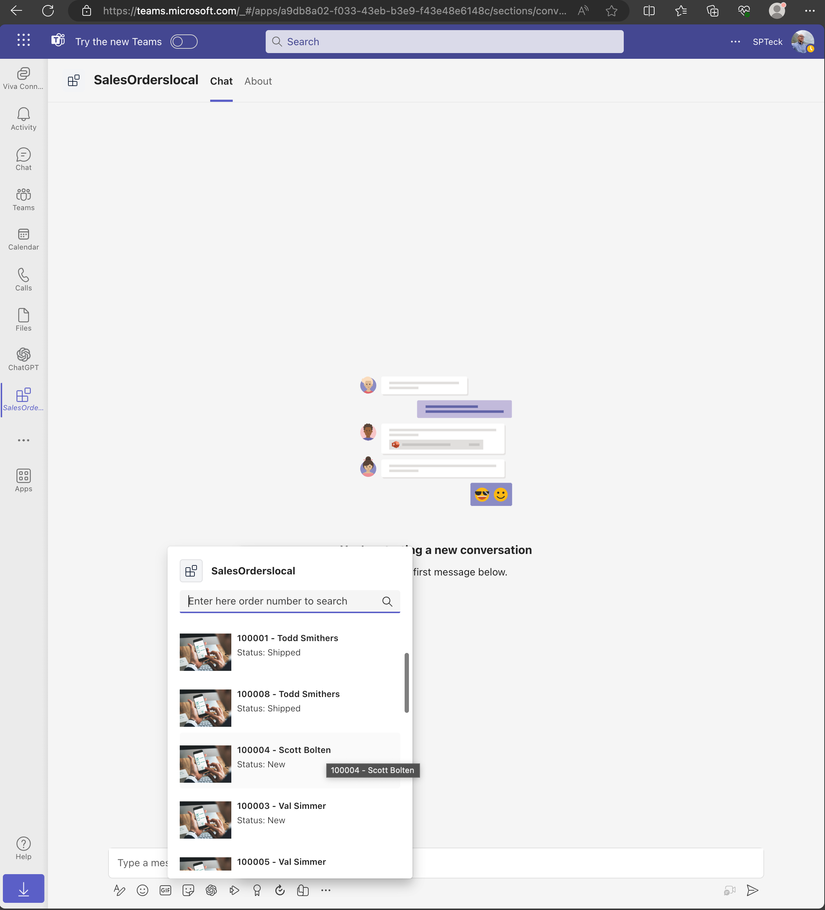
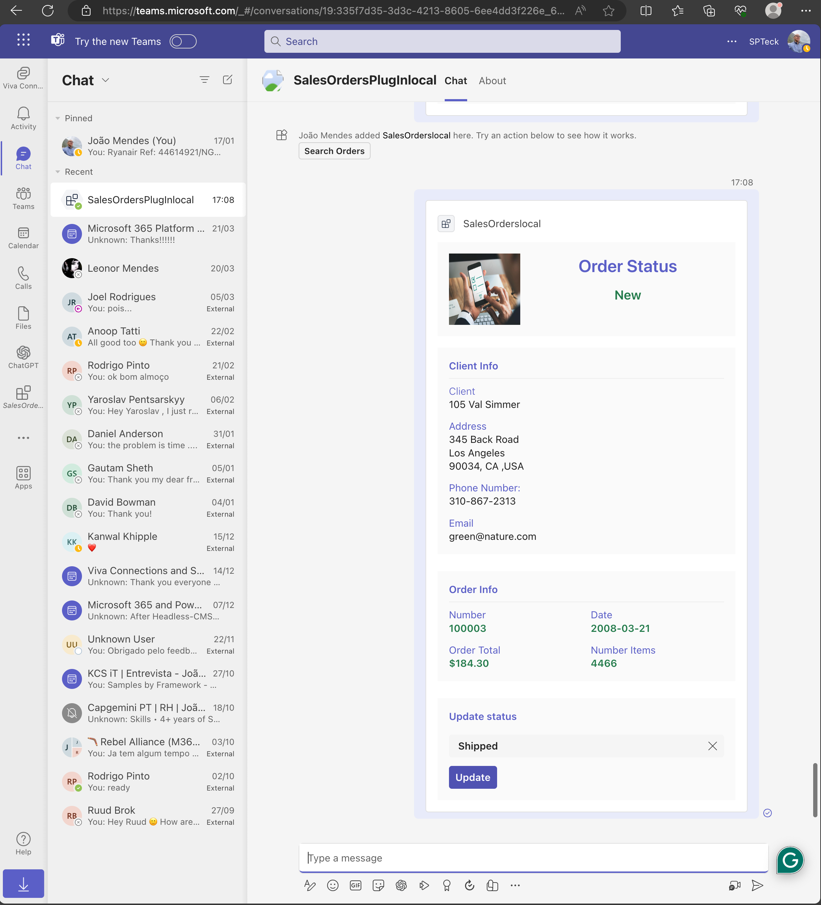
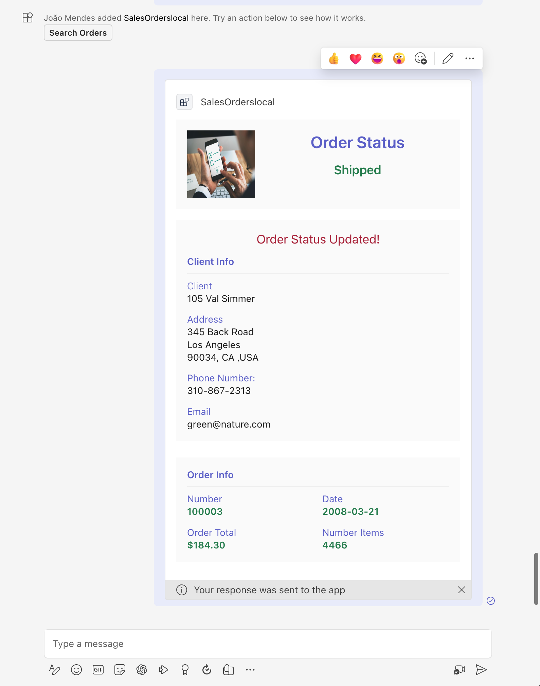

# Sales Orders message extension sample

This sample implements a Teams message extension that can be used as a plugin for Microsoft Copilot for Microsoft 365. The message extension allows users to query LOB Application DB2 Database, to update order status.

## Version history

Version|Manifest version|Date|Author|Comments
-------|--|--|----|--------
1.0|1.0|March 23, 2024 |João Mendes|Initial release for Ignite 2023 labs

## Prerequisites

- [Node.js 18.x](https://nodejs.org/download/release/v18.18.2/)
- [Visual Studio Code](https://code.visualstudio.com/)
- [Teams Toolkit](https://marketplace.visualstudio.com/items?itemName=TeamsDevApp.ms-teams-vscode-extension)
- You will need a Microsoft work or school account with [permissions to upload custom Teams applications](https://learn.microsoft.com/microsoftteams/platform/concepts/build-and-test/prepare-your-o365-tenant#enable-custom-teams-apps-and-turn-on-custom-app-uploading). The account will also need a Microsoft Copilot for Microsoft 365 license to use the extension in Copilot.

## Setup and use the sample

For instructions on setting up and running the sample, see the [lab exercises](./lab/Exercise%2000%20-%20Welcome.md).

## Example prompts for Copilot

Here are some ideas for prompts to try. If you don't get the result you expect, try typing "new chat" and then trying again.

### Single parameter prompts

- *Find sales orders with order status Shipped*

- *Who have Sales Orders with Order Status new?*

- *Find Sales Orders with Amount greater than $1000*

### Multi-parameter prompts

- *Find Sales Orders with Order Status new. Show me a table with the Order Number, Order Date, Amount. Reference the details for each pSales Order.*

